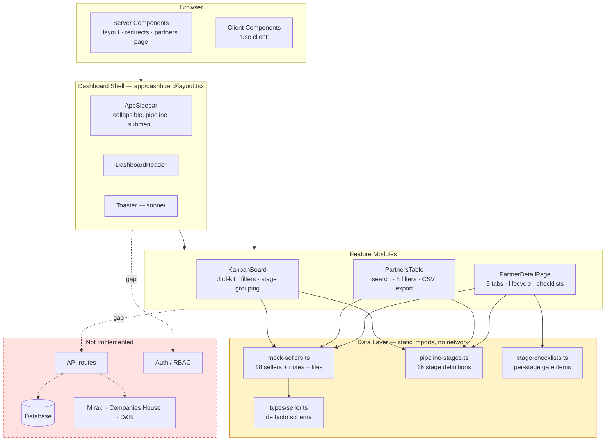
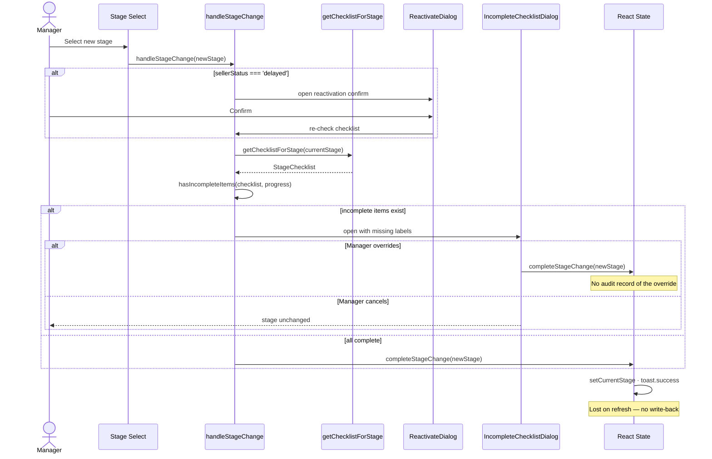
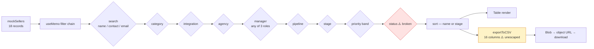
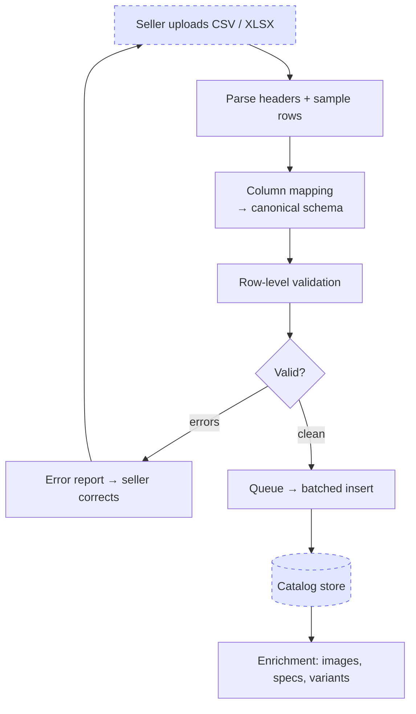

# v0-prm

This is a [Next.js](https://nextjs.org) project bootstrapped with [v0](https://v0.app).

## Built with v0

This repository is linked to a [v0](https://v0.app) project. You can continue developing by visiting the link below -- start new chats to make changes, and v0 will push commits directly to this repo. Every merge to `main` will automatically deploy.

[Continue working on v0 →](https://v0.app/chat/projects/prj_k8xrPYgjVP9kmwVojamQjFokdRuE)

## Getting Started

First, run the development server:

```bash
npm run dev
# or
yarn dev
# or
pnpm dev
```

Open [http://localhost:3000](http://localhost:3000) with your browser to see the result.

You can start editing the page by modifying `app/page.tsx`. The page auto-updates as you edit the file.

# Argos Partner Hub (`v0-prm`)

**A Partner Relationship Management (PRM) front-end for marketplace seller operations — tracking sellers across Acquisition, Onboarding, and Account Management pipelines with stage-gated checklists.**

> **Status: UI prototype.** Every screen renders from a static in-memory fixture (`lib/data/mock-sellers.ts`). There is no database, no API layer, and no authentication in this repository. All mutations are React component state and are lost on refresh. See [Known Technical Debt](#7-known-technical-debt--vibecode-considerations) before planning production work.

---

## 1. Executive Overview & Commercial Engine

Argos Partner Hub is the **operator-side** tool for a multi-sided marketplace. It is not a seller-facing portal. Its user is the Seller Acquisition Manager (SAM), Onboarding Manager, or Account Manager who owns a book of partners and needs to know, at a glance, who is stuck and what is blocking them.

The product model is three sequential pipelines, each with its own stages and its own per-stage checklist of operational gates:

| Pipeline | Stages | Owner role |
|---|---|---|
| **Acquisition** | Identified → Prospecting → Pitched → Vetting → Compliance → Signoff | Seller Acquisition Manager |
| **Onboarding** | Shop Created → Initial QC Pass / QC Reject → Launch Upload → Sign Off → Hypercare | Onboarding Manager |
| **Account Management** | Stabilisation → Growing → Strategic → Performance Intervention | Account Manager |

### Capability → growth lever mapping

| Growth lever | What exists today | Honest assessment |
|---|---|---|
| **Onboarding Velocity** | Stage-gated checklists for all 16 stages; a blocking dialog when a manager advances a seller with incomplete items; `daysIdle` on the seller record; Delayed / Terminated lifecycle states with reason capture | **Strongest area.** Makes friction *visible* to an internal operator. It does not yet *reduce* it — there is no seller self-serve, no automated verification, and `daysIdle` is a static fixture value, not computed from stage-entry timestamps. |
| **SKU Density & Quality** | `numberOfProductsExpected` on the seller record; `primaryProductCategories`; onboarding checklist items for *Products uploaded*, *Imagery approved*, *Pricing validated* | **Not built.** There is no catalog entity, no SKU ingestion, no CSV pipeline, no taxonomy mapping. SKU work today is a checkbox an operator ticks by hand. |
| **Partner LTV** | Account Management pipeline with `healthStatus` (healthy / at-risk / critical); notes timeline; Performance Intervention stage; per-stage QBR-style checklists | **Structural only.** Health status is a fixture field, not derived from behaviour. No commission tiers, no engagement scoring, no retention triggers. |
| **GMV Engine** | `gmvPotential` band (low → very-high) and a GMV Value (£) checklist field captured at the Pitched stage; `integrationMethod` (Linnworks / ChannelAdvisor / Brightpearl / TradeGecko / manual); a Mirakl shop-ID linking field | **Forecast only.** These are manager-entered estimates. There is no order sync, no fulfillment integration, and no actual GMV telemetry flowing in. |

**Bottom line for a technical reader:** this repo is a well-structured, high-fidelity operator workflow UI. The commercial engine above is currently modelled in the *type system and checklist data*, not in running services. That is the gap the roadmap closes.

---

## 2. Current Feature Matrix (State of the App Today)

Legend: ✅ Implemented · 🟡 Partial / UI-only (no persistence) · 🔴 Stub or placeholder · ⬜ Not started

### Auth & Partner Onboarding

| Feature | Status | Notes |
|---|---|---|
| Authentication / session | ⬜ | No auth provider, no middleware, no protected routes. `app/dashboard/*` is fully public. |
| User identity | 🔴 | Hardcoded `test` / `admin` in `components/dashboard/app-sidebar.tsx`. Profile / Sign out menu items have no handlers. |
| Role-based access (SAM / Onboarding / AM) | ⬜ | Manager names exist as string fields on the seller; no user table, no permission model. |
| Partner creation | 🔴 | `Add Partner` button renders in `partners-table.tsx` with **no `onClick` handler**. |
| Seller record model | ✅ | `lib/types/seller.ts` — legal identity (CRN, VAT, registered address), business details, contacts, pipeline assignment, compliance flags, filter dimensions. |

### Pipeline & Stage Engine

| Feature | Status | Notes |
|---|---|---|
| Three-pipeline Kanban (`/dashboard/pipeline`) | ✅ | `components/pipeline/kanban-board.tsx`, driven by `?view=` query param. |
| Drag-and-drop stage transitions | 🟡 | `@dnd-kit` with column + card drop targets. State only — **not persisted, and not checklist-gated**. |
| Stage definitions & colour tokens | ✅ | `lib/data/pipeline-stages.ts` — 16 stages across 3 pipelines. |
| Per-stage checklists | ✅ | `lib/data/stage-checklists.ts` — checkbox / dropdown / text / currency item types. |
| Checklist gating on stage advance | 🟡 | `handleStageChange` → `IncompleteChecklistDialog`. Enforced on the **detail page dropdown only**; the Kanban drag bypasses it entirely. |
| Priority scoring | ✅ | 1.0–5.0 scale → Critical / High / Medium / Low bands via `getPriorityLevel`. Note: the scale is **inverted** — a *lower* score is a *higher* priority. |
| Pipeline filters (SAM manager, priority) | 🔴 | Renders, but the manager filter is broken — see technical debt §7.2. |
| "Group by SAM Manager" checkbox | 🔴 | Renders with no bound state or handler. |

### Partner Detail Workspace (`/dashboard/partners/[id]`)

| Feature | Status | Notes |
|---|---|---|
| Overview tab | ✅ | Supplier Details, Business Metrics, Contact Details, Assignment, Compliance Checks. |
| Drag-to-reorder overview sections | 🟡 | `@dnd-kit/sortable`; order resets on navigation. |
| Copy-to-clipboard on identity fields | ✅ | CRN, VAT, address, with a 2s confirmation state. |
| Checklist tab | 🟡 | Full pipeline checklist tree with completion tracking in local state. |
| Notes tab | 🔴 | Reads `mockNotes`; `handleAddNote` fires a success toast and clears the textarea — **the note is never stored or rendered**. |
| Files tab | 🔴 | Reads `mockFiles`; upload button fires `toast.success('File upload functionality coming soon')`. No storage backend. |
| Management tab | 🟡 | Editable trading name / email / phone / URL; Save fires a toast and discards the values (uncontrolled `defaultValue` inputs). |
| Lifecycle status (Active / Delayed / Terminated) | 🟡 | Reason + notes capture, type-to-confirm termination dialog, and a reactivation-on-stage-change flow. Well-modelled UX; state only. |
| Mirakl shop linking | 🔴 | `miraklName` / `miraklId` inputs auto-fill a fake padded ID (`ID:0001`). No Mirakl API call. Note the fixture field is misspelled `mirakiLinked`. |
| Contact management | 🟡 | Primary + additional contacts, add/edit/delete dialogs, role taxonomy. Contains a React bug — see §7.3. |

### Partner Directory (`/dashboard/partners`)

| Feature | Status | Notes |
|---|---|---|
| Sortable table | ✅ | Sort by name or stage, asc/desc. |
| Free-text search | ✅ | Matches company name, primary contact name, and primary contact email. |
| Multi-select filter bar | 🟡 | 8 dimensions: category, integration, agency, manager, pipeline, stage, priority, status. Seven work; **status is broken** (§7.2). |
| Active filter chips with individual removal | ✅ | |
| CSV export | 🟡 | 16-column client-side export. **Unescaped** — see §7.5. |

### Integrations / API Middleware

| Feature | Status | Notes |
|---|---|---|
| API routes | ⬜ | No `app/api` directory exists. |
| Database | ⬜ | No ORM, no schema, no migrations, no connection string. |
| Companies House / D&B verification | ⬜ | `companiesHousePass` and `dnbPass` are manually-set booleans on the fixture. |
| Mirakl | ⬜ | UI field only. |
| Inventory integrations (Linnworks etc.) | ⬜ | Enum value on the seller record only. |
| Analytics | ✅ | `@vercel/analytics`, production builds only. |

### Admin

| Feature | Status | Notes |
|---|---|---|
| `/dashboard/team` | 🔴 | "Team management coming soon..." placeholder. |
| `/dashboard/settings` | 🔴 | "Settings view coming soon..." placeholder. |

---

## 3. Technical Architecture & Stack

### Stack

| Layer | Technology |
|---|---|
| Framework | Next.js **16.2.6** (App Router) |
| Runtime | React **19.2.4** |
| Language | TypeScript **5.7.3** (`strict: true`, but see §7.1) |
| Styling | Tailwind CSS **4.2** via `@tailwindcss/postcss`, `tw-animate-css` |
| Components | shadcn/ui (New York style) over Radix UI primitives — 50+ components in `components/ui` |
| Drag & drop | `@dnd-kit/core`, `@dnd-kit/sortable` |
| Notifications | `sonner` |
| Icons | `lucide-react` |
| Charts | `recharts` 2.15 — **installed, currently unused** |
| Forms / validation | `react-hook-form` + `zod` + `@hookform/resolvers` — **installed, currently unused**; all forms are hand-rolled `useState` |
| Package manager | pnpm (`pnpm-lock.yaml`) |
| Deploy | Vercel, auto-deploy on merge to `main`; generated and synced from [v0](https://v0.app) |

### Data layer

There is no database. The entire application reads from three exported constants:

| Export | File | Contents |
|---|---|---|
| `mockSellers` | `lib/data/mock-sellers.ts` | 18 `Seller` records across all three pipelines |
| `mockNotes` | `lib/data/mock-sellers.ts` | `Note[]` keyed by `sellerId` |
| `mockFiles` | `lib/data/mock-sellers.ts` | `SellerFile[]` metadata only — no blobs |

The `Seller` interface in `lib/types/seller.ts` is the de facto schema and is the right starting point for a real migration. Its shape:

```
Seller
├── Legal identity      id, companyName, crn, countryOfRegistration, vatNumber, registeredAddress
├── Business details    websiteUrl, primaryProductCategories[], numberOfProductsExpected
├── Contacts            primaryContact (required), additionalContacts[]
├── Pipeline position   pipeline, stage, priorityScore
├── Ownership           acquisitionManager, onboardingManager, accountManager
├── Filter dimensions   category, integrationMethod, agency, daysIdle
├── Commercial          gmvPotential
├── Compliance          companiesHousePass, dnbPass, rejectionReason
├── Platform            mirakiLinked  [sic]
├── Health              healthStatus
└── Progress            checklistProgress?: StageChecklistCompletion[]
```

Note that `checklistProgress` is **declared on the type but never populated** — the detail page keeps its own flat `Record<itemId, ChecklistItemCompletion>` in local state instead. Reconciling these two shapes is a prerequisite for persistence.

### Route map

| Route | Type | Purpose |
|---|---|---|
| `/` | Server | Redirect → `/dashboard` |
| `/dashboard` | Server | Redirect → `/dashboard/pipeline` |
| `/dashboard/pipeline?view=<type>` | Client | Kanban board; `view` ∈ `acquisition` \| `onboarding` \| `account-management` |
| `/dashboard/partners` | Server | Renders `<PartnersTable sellers={mockSellers} />` |
| `/dashboard/partners/[id]` | Client | 1,488-line five-tab partner workspace |
| `/dashboard/team` | Server | Placeholder |
| `/dashboard/settings` | Server | Placeholder |

### Architecture diagram



---

## 4. Data Flow & Pipeline Highlights

### 4.1 Stage advancement with checklist gating

This is the most commercially significant flow in the app — it is where Onboarding Velocity is either enforced or leaked. Implemented in `app/dashboard/partners/[id]/page.tsx`.



**Two leaks worth naming.** First, the Kanban drag handler (`kanban-board.tsx → handleDragEnd`) performs no checklist validation at all — the same transition is gated on one screen and open on the other. Second, an override is allowed with no reason captured and no audit trail, so you cannot later measure *which* gates are routinely skipped.

### 4.2 Partner directory: filter → render → export



Note that the object URL created in `exportToCSV` is never revoked, leaking a blob reference per export.

### 4.3 Where the SKU ingestion pipeline would go

There is no bulk SKU ingestion in this repository. For roadmap clarity, this is the flow the current architecture is missing entirely — every node below is unbuilt:



---

## 5. Local Development & Setup Guide

### Prerequisites

- Node.js 20+ (Next.js 16 requirement)
- pnpm 9+ — `npm install -g pnpm`

### Install and run

```bash
git clone https://github.com/MarcusW9/v0-prm.git
cd v0-prm
pnpm install
pnpm dev
```

Open <http://localhost:3000> — it redirects to `/dashboard/pipeline?view=acquisition`.

### Commands

| Command | Purpose |
|---|---|
| `pnpm dev` | Dev server with HMR |
| `pnpm build` | Production build (**TypeScript errors are suppressed** — see §7.1) |
| `pnpm start` | Serve the production build |
| `pnpm lint` | ⚠️ **Currently fails** — the script calls `eslint .` but ESLint is not a dependency and no config file exists |

### Environment variables

**None are required.** The only `process.env` reference in the codebase is `NODE_ENV` in `app/layout.tsx`, which gates Vercel Analytics to production builds. There is no `.env.example` because there is nothing yet to configure.

Once a backend lands, the first variables will be roughly:

```bash
# .env.example — ANTICIPATED, none of these are read today
DATABASE_URL=
NEXTAUTH_SECRET=
NEXTAUTH_URL=http://localhost:3000
MIRAKL_API_URL=
MIRAKL_API_KEY=
COMPANIES_HOUSE_API_KEY=
DNB_API_KEY=
BLOB_READ_WRITE_TOKEN=
```

### Note on the v0 sync

This repo is linked to a [v0](https://v0.app) project and v0 pushes commits directly to `main`. **Hand-written changes can be overwritten by a v0 generation.** Agree a convention before doing substantial manual work — either freeze v0 on the files you are hardening, or branch.

---

## 6. Known Technical Debt & Vibecode Considerations

Ordered by how much damage each will do if it reaches production.

### 6.1 `ignoreBuildErrors: true` is masking real type errors 🔴

```js
// next.config.mjs
typescript: { ignoreBuildErrors: true }
```

`tsconfig.json` sets `strict: true`, and then the build throws the result away. This is not theoretical — it is actively hiding the two broken filters below. **Remove this flag, fix what falls out, and keep it removed.** It is the single highest-value hour of work in the repo.

### 6.2 Two filters are silently broken 🔴

**Pipeline SAM Manager filter** — `kanban-board.tsx:55` reads a property that does not exist:

```ts
if (samManagerFilter !== 'all' && seller.samManager !== samManagerFilter) return false
```

`Seller` has `acquisitionManager`, `onboardingManager`, and `accountManager` — there is no `samManager`. The comparison is always `undefined !== '<name>'`, so **selecting any manager empties the entire board**. It should read the manager field matching the active pipeline.

**Partners table status filter** — `partners-table.tsx:260` reads `seller.status`, and `partners-table.tsx:6` imports a `SellerStatus` type that `lib/types/seller.ts` does not export. Lifecycle status lives only in the detail page's local state and was never added to the `Seller` model. Selecting any status value **empties the table**.

Both are compile errors. Both are invisible because of §6.1.

### 6.3 `useState` used as `useEffect` 🟡

`components/partner/contact-management.tsx:182`:

```ts
useState(() => {
  if (contact) { setName(contact.name); /* ... */ }
})
```

`useState(fn)` runs the initializer **once on mount** and discards the return value. The intent was to resync form fields when `contact` changes. Consequence: opening the edit dialog for contact A, closing it, then opening it for contact B can show A's values. Replace with `useEffect([contact])`, or key the dialog by `contact.id` so React remounts it.

### 6.4 No persistence — every mutation is ephemeral 🔴

Stage changes, checklist ticks, notes, contact edits, lifecycle status, and the Management tab's form all live in component state and vanish on refresh. Several actions fire `toast.success(...)` for work that never happened, which is worse than no feedback — it teaches operators to trust a write that did not occur.

Prerequisites before this can be fixed properly:

- A canonical schema derived from `lib/types/seller.ts`
- Reconciling `Seller.checklistProgress` (declared, unused) with the flat `Record<itemId, …>` the UI actually maintains
- **Namespacing checklist item IDs by stage.** Progress is keyed on `itemId` alone. IDs happen to be unique today, but `rejection-reason` already appears in the Compliance checklist and nothing prevents a future stage from reusing it — at which point ticking one silently ticks the other. Key on `${stageId}:${itemId}`.

### 6.5 CSV export is unescaped 🟡

`exportToCSV` wraps every cell in quotes but does not escape quotes **inside** cell values. A company name containing `"` produces a malformed row and shifts every subsequent column. There is also no guard against formula injection — a cell beginning with `=`, `+`, `-`, or `@` executes when opened in Excel. Prefix such values with `'` or use a CSV library.

Minor: the object URL from `URL.createObjectURL` is never passed to `URL.revokeObjectURL`.

### 6.6 Mock data ships inside the client bundle 🟡

`mockSellers` is imported directly into `'use client'` components, so all 18 seller records are serialised into the JS bundle. At fixture scale this is invisible; at 500 partners it is not. The Kanban and table also filter and sort the full array in `useMemo` on every keystroke. Server-side filtering and pagination are needed before the partner count grows — not because 18 is slow, but because the *shape* of the code assumes the full dataset is always in hand.

### 6.7 No auth, no authorisation 🔴

Every `/dashboard` route is publicly reachable. The sidebar user is hardcoded to `test` / `admin`. Manager assignment is a free-text string with no backing user entity. Since the app displays company registration numbers, VAT numbers, registered addresses, and named contacts, **this cannot be deployed to a public URL with real partner data in its current state.**

### 6.8 Smaller items 🟡

| Item | Detail |
|---|---|
| Kanban bypasses gating | `handleDragEnd` moves a card between any two stages with no checklist check and no stage-order validation |
| Type cast papers over the union | `{ ...seller, stage: targetStageId as string }` — `stage` is a `PipelineStage` union, not `string` |
| `required` flag ignored | `hasIncompleteItems` filters on `!progress[id]?.completed` and never reads `ChecklistItem.required`, so every optional item blocks advancement |
| Dead controls | `Add Partner` (no handler), `Group by SAM Manager` (unbound checkbox), sidebar Profile / Account Settings / Sign out |
| Fixture typo | `mirakiLinked` should be `miraklLinked` — rename before it reaches a schema |
| Duplicate stylesheet | `styles/globals.css` is byte-identical to `app/globals.css` and unused; delete it |
| Static `daysIdle` | A fixture integer, not derived from stage-entry timestamps — so the idle-partner signal is decorative |
| Unused dependencies | `recharts`, `zod`, `react-hook-form`, `@hookform/resolvers` are installed but never imported; adopt them for forms or drop them |
| No tests | No runner, no test files, no CI |
| `page.tsx` is 1,488 lines | The partner detail page holds 20+ `useState` hooks, five tabs, and four dialogs in one client component. Extract per-tab components before adding to it. |
| Inverted priority scale | Lower `priorityScore` = higher priority. Correct as implemented, but unlabelled in the UI and a guaranteed source of bugs for the next developer. |

---

## 7. Immediate Roadmap (Next Up)

### Horizon 0 — Stop the bleeding (this week, ~1 day total)

Not feature work, but nothing below is safe to build on until it is done.

1. Remove `ignoreBuildErrors` and fix the resulting errors — **§6.1, §6.2**
2. Fix the SAM manager and status filters — **§6.2**
3. Fix `useState` → `useEffect` in contact management — **§6.3**
4. Add ESLint as a dependency with a config so `pnpm lint` runs — **§5**
5. Delete `styles/globals.css`; rename `mirakiLinked` — **§6.8**

### Horizon 1 — Immediate growth friction (1–2 weeks)

| Item | Lever | Why |
|---|---|---|
| **Persistence layer** — schema from `lib/types/seller.ts`, API routes, replace fixture imports | All four | Nothing else compounds until writes survive a refresh. This is the true blocker. |
| **Auth + role model** — sessions, protected routes, real user entities behind manager assignment | Onboarding | Required before any real partner data enters the system (§6.7). |
| **Stage-transition audit log** — who moved what, when, and which gates were overridden and why | Onboarding Velocity | Turns the checklist from a UI nicety into a measurable funnel. You cannot fix the drop-off you cannot see. |
| **Gate the Kanban drag** — run the same checklist validation as the detail page | Onboarding Velocity | Closes the leak in §4.1; small change, immediate integrity win. |
| **Computed `daysIdle` + stage-entry timestamps** | Onboarding Velocity | Makes stuck partners surface themselves instead of requiring a manager to notice. |

### Horizon 2 — Monetisation & performance multipliers (3–6 weeks)

| Item | Lever | Why |
|---|---|---|
| **Catalog entity + bulk SKU ingestion** (the §4.3 flow: upload → assisted column mapping → row validation → batched insert) | SKU Density | The single largest gap between this PRM and a marketplace growth tool. Ship the smallest version first: upload, map, preview, publish valid rows. |
| **Notes and file storage made real** | LTV | Two of the three most-used operator surfaces are currently toasts over a void. |
| **Partner analytics** — `recharts` is already installed; stage velocity, conversion by stage, manager throughput | LTV | Converts the audit log into a decision surface. |
| **Commission tiers on the seller model** | LTV / GMV | Gives Account Management a lever beyond conversation. |

### Horizon 3 — Ecosystem & moats (6+ weeks)

| Item | Lever |
|---|---|
| Companies House and D&B verification APIs replacing manual pass/fail booleans | Onboarding Velocity |
| Live Mirakl shop linking and order sync | GMV |
| Inventory platform integrations (Linnworks, ChannelAdvisor, Brightpearl) | GMV |
| AI catalog enrichment — images, specs, variants — on top of a working ingestion pipeline | SKU Quality |
| Seller-facing self-serve portal | Onboarding Velocity |

---

*Generated from a full read of `main` @ `8a8208f`, 21 September 2026. Feature statuses reflect the code as committed, not intent.*
